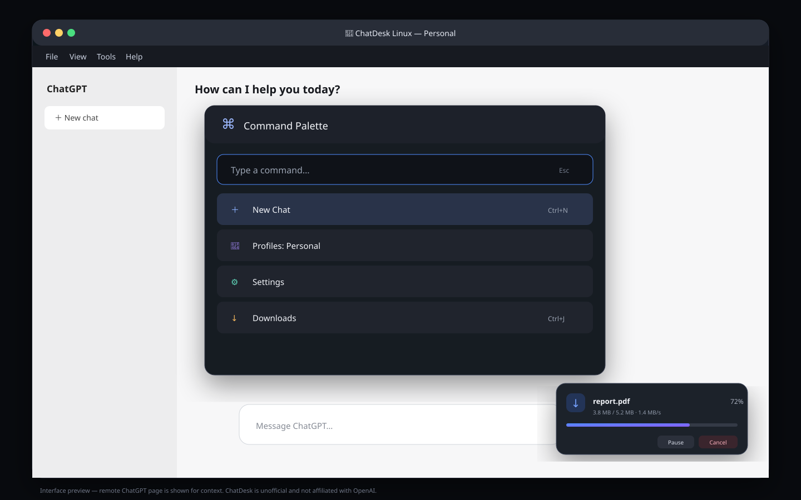

# ChatDesk Linux

**An unofficial ChatGPT desktop app for Linux**, built and maintained by **Milmit**.

ChatDesk Linux opens `https://chatgpt.com` in isolated Electron sessions and adds native Linux workflows around it. It does not inject custom JavaScript or CSS into ChatGPT and does not claim to be an official OpenAI client.

> ChatDesk Linux is not affiliated with, sponsored by, or endorsed by OpenAI. ChatGPT and OpenAI are trademarks of their respective owners.



## Highlights in 0.5.1

- **Quick Capture** from the Linux clipboard or X11/Wayland selection with `Ctrl+Shift+Space`
- **Independent profile windows** with separate persistent sessions, titles, colors, and saved bounds
- **Compact Mode** with animated left/right docking and always-on-top behavior
- **Workspace presets** for profile, window size, compact mode, side, zoom, theme, start page, and shortcut
- **Prompt Library** with categories, favorites, shortcuts, and `{clipboard}`, `{selection}`, `{date}`, and `{profile}` variables
- **Advanced Command Palette** with fuzzy search, favorites, recent commands, profiles, prompts, and workspaces
- **`chatdesk://` deep links** for new chats, panels, profiles, Quick Capture, and workspaces
- **Share to ChatDesk** through file associations, launcher arguments, drag-and-drop, and a local staging queue
- **Private capture history**, disabled by default, with secret detection, bounded history, mode `0600`, and Linux keyring encryption when a secure backend exists
- **Installation Health**, built-in sanitized Log Viewer, and a privacy-safe Report Issue wizard
- **Animated profile switching, download completion, activity cards, Compact Mode, and Command Palette transitions**
- **CodeQL, dependency review, Dependabot, SPDX SBOMs, SHA-256 checksums, and signed GitHub artifact attestations** for public releases

## Core desktop features

- Native Ubuntu/Linux title bar and application menu
- Animated splash, offline screen, Retry flow, and crash recovery
- Persistent window size, position, maximized state, and single-instance handling
- System tray and optional minimize-to-tray
- Configurable global shortcuts with Wayland portal support
- English and Persian local interface with RTL support
- System/light/dark themes, zoom, spell-check, autostart, and hardware acceleration controls
- Download progress, speed, pause, resume, cancel, open, show in folder, notifications, and floating Activity Center
- Manual and optional daily GitHub release checks
- Diagnostics, Safe Mode, settings export/import, and factory reset

## Quick Capture

Default shortcut:

```text
Ctrl+Shift+Space
```

Quick Capture can read the regular clipboard or Linux selection buffer, apply a saved prompt template, choose a profile, and open either the current chat, a new chat, or an independent profile window. It copies the prepared text locally; paste it with `Ctrl+V`.

It deliberately does **not** automate ChatGPT's DOM or send messages without user confirmation. That would be brittle and would weaken the security boundary.

## Multiple profiles and windows

Each profile receives a separate persistent Electron partition:

```text
Personal
Work
Testing
```

Use **Tools → Profiles** or the Command Palette to open separate windows. Cookies and login sessions are not shared between profile partitions.

## Compact Mode and workspaces

Compact Mode docks a narrow always-on-top window to either side of the current display. Workspaces save a repeatable combination of:

- profile;
- width and height;
- compact mode and dock side;
- always-on-top;
- zoom;
- local theme;
- current or new-chat start page;
- optional global shortcut.

## Deep links

After installing the DEB/AppImage desktop integration, examples include:

```bash
xdg-open 'chatdesk://new?profile=work'
xdg-open 'chatdesk://capture?profile=personal'
xdg-open 'chatdesk://open/settings'
xdg-open 'chatdesk://open/downloads'
xdg-open 'chatdesk://workspace?id=coding'
xdg-open 'chatdesk://profile?profile=testing'
```

Unknown actions and invalid identifiers are rejected.

## Share to ChatDesk

Supported text, PDF, JSON, and common image files can be opened with ChatDesk or dragged onto **Tools → Share to ChatDesk**. Files are staged locally and shown in a Drop Zone. ChatDesk does not silently upload them or bypass ChatGPT's file picker.

## Private capture history

Capture history is **off by default** and only stores text explicitly submitted through ChatDesk. It:

- rejects likely passwords, tokens, private keys, and card-like values;
- stores at most the configured number of items;
- uses file mode `0600`;
- uses Electron safe storage backed by GNOME Keyring/KWallet when a secure backend is available;
- falls back to file permissions only when Linux exposes no secure keyring backend, and reports that state in the UI.

## Clipboard troubleshooting

ChatGPT pages may write sanitized text to the clipboard on approved ChatGPT/OpenAI origins. Clipboard reads by the remote page remain denied. To test the native path:

```text
Tools → Diagnostics → Test Clipboard
```

Then paste into a text editor.

## Default shortcuts

- `Ctrl+Shift+M`: show or hide ChatDesk
- `Ctrl+Shift+Space`: Quick Capture
- `Ctrl+Shift+P`: Command Palette
- `Ctrl+Shift+C`: Compact Mode
- `Ctrl+Shift+A`: Activity Center

Workspace and prompt shortcuts are configurable. On Wayland, desktop portal approval may be required.

## Diagnostics and support

- **Tools → Installation Health** checks sandbox setup, data-directory access, network state, notifications, deep-link registration, shortcuts, and profile partitioning.
- **Tools → Logs** filters, copies, exports, and clears sanitized local logs.
- **Help → Report a Problem** generates a reviewable Markdown report without cookies, prompts, or conversation content.
- `chatdesk-linux --safe-mode` disables optional integrations and animations for troubleshooting.

## Development

Requires Node.js 24 or newer.

```bash
npm install
npm test
npm run check
npm start

# Optional real Electron shell smoke test on Linux
npm run test:ui
```

Do not run `npm audit fix --force` blindly; it may downgrade or break the build toolchain.

## Build

```bash
npm run dist:linux
```

Outputs are written to `dist/` as AppImage and DEB packages.

## Release security

Tagged GitHub builds run syntax checks, unit/contract tests, an Electron smoke test under Xvfb, AppImage/DEB packaging, SPDX SBOM generation, SHA-256 checksum generation, build-provenance attestation, and SBOM attestation. CodeQL and dependency review run separately.

Verify checksums:

```bash
sha256sum -c SHA256SUMS --ignore-missing
```

Verify GitHub provenance after publishing:

```bash
gh attestation verify ./chatdesk-linux-0.5.1-x86_64.AppImage -R MilMit/chatdesk-linux
```

A committed npm lockfile is still required before claiming byte-for-byte reproducible dependency resolution. The current workflow provides traceable and cryptographically signed provenance, not traditional GPG package signing.

## Security

Remote ChatGPT content has Node.js integration disabled, context isolation enabled, Chromium sandboxing enabled, navigation restrictions, a permission allowlist, and no privileged preload bridge. Local UI IPC validates senders and exposes explicit channel allowlists.

Read [SECURITY.md](SECURITY.md) before changing security controls.

## License and upstream

MIT licensed. Derived from `xanmoy/chatgpt-desktop-client`; the original copyright notice is preserved.

## Publish a release

After signing in with GitHub CLI and reviewing the changes:

```bash
npm run release:github
```

The script runs tests, builds AppImage and DEB assets, creates checksums and an SPDX SBOM, pushes `main` and the version tag, and ensures the GitHub Release contains the artifacts.

### Long-response stability

ChatDesk keeps long Thinking responses active in the background, avoids treating temporary renderer stalls as crashes, records privacy-safe stream errors in Diagnostics, and offers **Recover Current Chat** to reload the same conversation when the server has completed an answer after a connection interruption.
